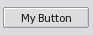
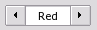
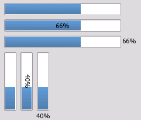
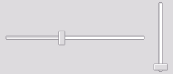
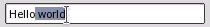

SFML Widgets
============

A simple GUI module for SFML.

- Spritesheet based: a single image file to customize widget style
- Simple events: set a `std::function<void(void)>` callback on widgets to trigger functions on UI events.
- Layouts: automatically align content without computing positions


- Author: Alexandre Bodelot <alexandre.bodelot@gmail.com>
- License: [MIT License](http://opensource.org/licenses/MIT) (See LICENSE file)

Run `make` to build the library (`lib/libsfml-widgets.a`) and the demo program.

You can then run the demo: `./sfml-widgets-demo`

## Setup

1. Load resources (font, spritesheet) in static class `gui::Theme`
2. Use `gui::Menu` to create a new sfml-widgets menu. It needs to be connected to your SFML render window, which is given to the constructor.
3. Create widgets, add theme to the menu and define callbacks on them. NOTE: widgets must be dynamically allocated (`new`). The `gui::Menu` destructor will take care of deallocating widgets.

Minimal example:

```cpp
#include <iostream>
#include <SFML/Graphics.hpp>
#include "Gui/Gui.hpp"

int main()
{
    sf::RenderWindow app(sf::VideoMode(800, 600), "SFML Widgets", sf::Style::Close);

    // Declare menu
    gui::Menu menu(app);

    gui::Theme::loadFont("demo/tahoma.ttf");
    gui::Theme::loadTexture("demo/texture-default.png");

    // Create some button widget
    gui::Button* button = new gui::Button("My button");

    // Insert button into menu
    menu.add(button);

    // Define a callback
    button->setCallback([] {
        std::cout << "click!" << std::endl;
    });

    // Start the application loop
    while (app.isOpen())
    {
        // Process events
        sf::Event event;
        while (app.pollEvent(event))
        {
            // Send events to the menu
            menu.onEvent(event);

            if (event.type == sf::Event::Closed)
                app.close();
        }

        // Optional: clear window with theme background color
        app.clear(gui::Theme::windowBgColor);

        // Render menu
        app.draw(menu);

        // Update the window
        app.display();
    }

    return 0;
}
```

`demo/demo.cpp` conains a more complex example, featuring all widgets.

## Widgets

### `gui::Button`

A simple press button.



### `gui::Checkbox`

A button with enabled/disabled state.


### `gui::Image`

Displays an SFML texture.

It's a simple wrapper around `sf::Texture`, to display a texture as part of the UI.

### `gui::Label`

A static text element.

It's a simple wrapper around `sf::Text`, to display a text as part of the UI.

### `gui::OptionsBox`

A list of label/value pairs.



Use templates to define value type. Example: `gui::OptionsBox<sf::Color>`.

Add value with: `optionsBox->addItem("Red", sf::Color::Red)`;

### `gui::ProgressBar`

A simple horizontal or vertical progress bar.



* `orientation`: `gui::Horizontal` or `gui::Vertical`
* `labelPlacement`: `gui::LabelNone`, or `gui::LabelOver`, or `gui::Outside`

### `gui::Slider`

Provides an horizontal or vertical slider.



* `orientation`: `gui::Horizontal` or `gui::Vertical`

### `gui::TextBox`

A one-line text editor.



It supports text cursor, and text selection (with mouse or keyboard shortcuts).

## Layouts

Layouts are containers for widgets. They are also widgets themselves, and can be nested!

### `gui::Menu`

The special, unique root layout. It behave like a `VBoxLayout`.

### `gui::HBoxLayout`

Lines up widgets horizontally.

Use `layout->add(widget)` to append a widget on a new line.

### `gui::VBoxLayout`

Lines up widgets vertically.

Use `layout->add(widget)` to append a widget on a new column.

### `gui::FormLayout`

Manages forms of input widgets and their associated labels.

Use `layout->addRow("my label", widget)` to add a new line with label on the left, and widget on the right.

## Theming

To customize the theme, you can:

- Change the theme values (padding, color, font, etc.) defined the static class `gui::Theme`.
- Use a custom spritesheet image.
